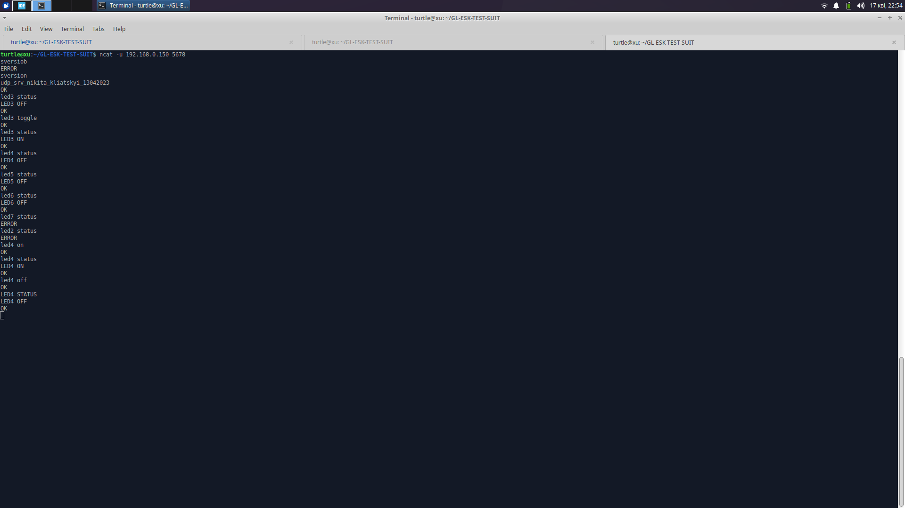
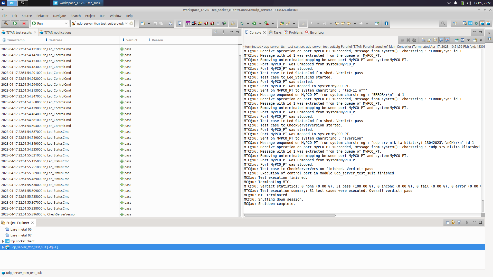
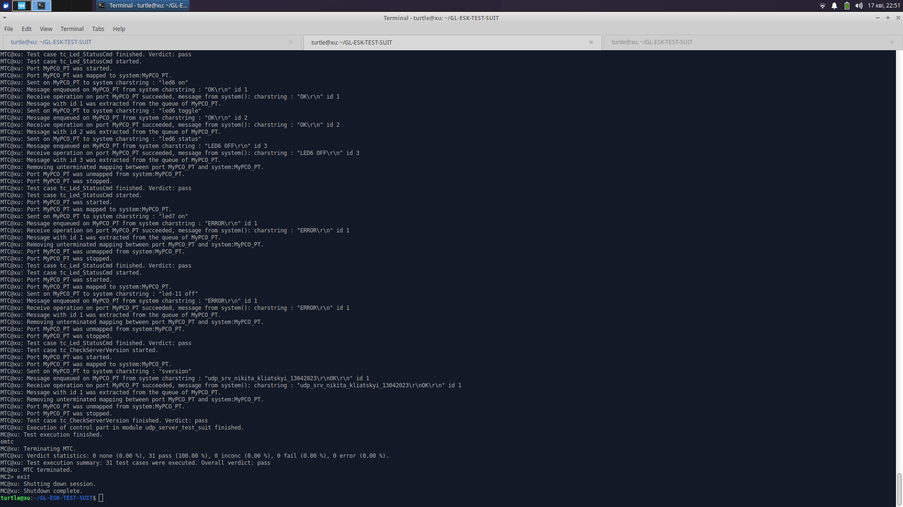

# GL-ESK-ETHERNET

## Assignment
1. Implement a UDP server, that must be launched in a separate thread of the tcp socket client project
2. The UDP server must accept and execute the following commands from the UDP client :
- sversion : get a server version
- led<N> on : turn on the LED<N>, where N = 3,4,5,6
- led<N> off : turn off the LED<N>, where N = 3,4,5,6
- led<N> toggle : toggle the LED<N>, where N = 3,4,5,6
- led<N> status: check LED<N> status, where N = 3,4,5,6

## [Solution](tcp_socket_client/Core/Src/udp_server.c)
When StartUdpServerTask function starts, it receives data with recvfrom function, parses it and sends an answer of the command to the user who'd sent it with sendto function.
Before parsing, line-break symbol is removed from received string. It's done to provide similar ways to work with data sent in different ways (for example, if user sends data with ncat, it ends with line-break symbol, as it is used to confirm sending user input, but tests, used for testing udp server, don't send line-break). Then, strtok is used for breaking the line into words and parsing.

Usage example (ncat is used) looks like this:

And here result of [this tests](https://github.com/PetroShevchenko/GL-ESK-TEST-SUIT) can be seen:

